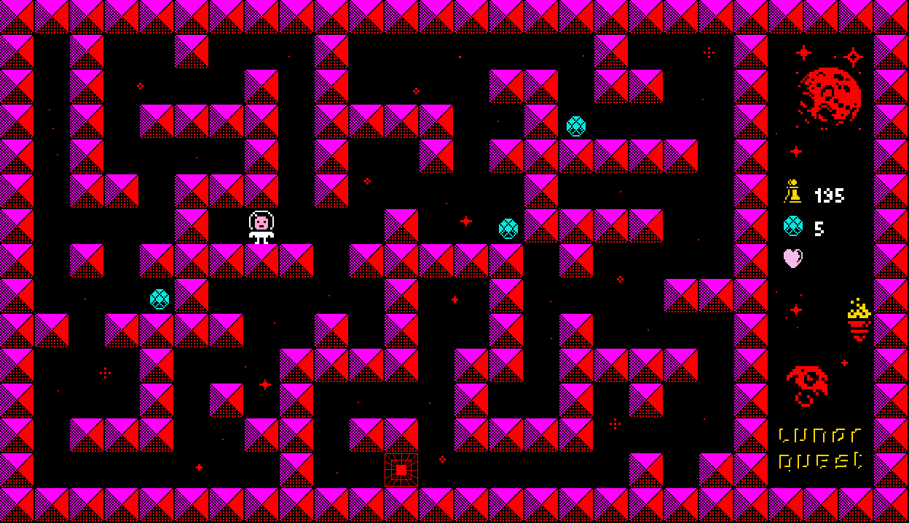

## 🌙 Lunar Quest

**Lunar Quest** est un jeu en 2D réalisé avec la MiniLibX dans le cadre du projet So Long de l'École 42. Le joueur évolue dans un labyrinthe galactique, doit récupérer des objets vitaux pour activer le portail spatial et l'atteindre avant de manquer d'oxygène.

## 🚀 Concept du jeu

Dans **Lunar Quest**, vous incarnez un explorateur coincé dans une station abandonnée sur une lune lointaine. Pour vous échapper, vous devez : 

- 🪐 Explorer le labyrinthe galactique
- ⭐ Collecter tous les items disséminés dans la carte
- 🚪 Activer le portail spatial (la sortie) une fois tous les items récupérés
- 🫁 Rejoindre la sortie avant de manquer d'oxygène

## 🕹️ Contrôles

- Flèches ➜ Déplacement
- H       ➜ Affiche ou masque le chemin le plus court vers la sortie (algorithme de pathfinding A*)
- ESC     ➜ Quitter
